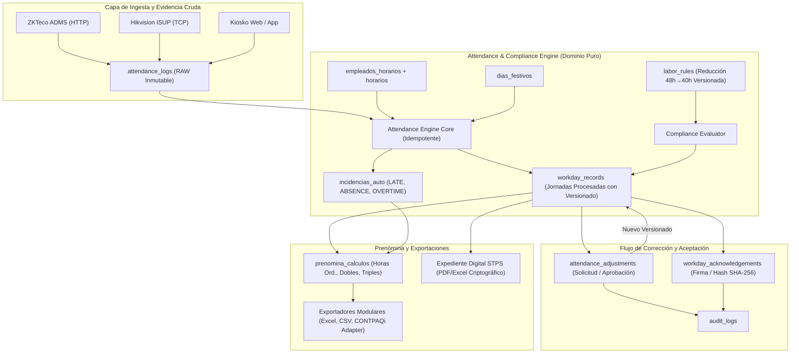

# Auditoría de Arquitectura y Factibilidad Técnica
## Módulo de Cumplimiento Laboral México 2027 (Jornada 48h → 40h, Registro Electrónico, Auditoría STPS y Prenómina)

> **Documento:** `docs/compliance-mexico-2027-audit.md`  
> **Sistema:** Signum-Clock / Signal-Clock  
> **Fecha de Auditoría:** Agosto 2026 / Fase de Preparación Regulatoria 2027  
> **Estado:** FASE 0 — Auditoría Completa Finalizada  
> **Aviso Legal:** *Los controles técnicos descritos constituyen mecanismos de registro, trazabilidad y cálculo automatizado. La validez legal ante la STPS, inspecciones laborales o tribunales colegiados requiere además la validación jurídica de políticas internas, contratos individuales/colectivos y constancias patronales.*

---

## 1. Resumen Ejecutivo y Estado Actual

Signum-Clock opera como una plataforma SaaS multi-tenant diseñada para el control de asistencia y sincronización de terminales biométricas (ZKTeco ADMS vía HTTP y Hikvision ISUP 5.0 vía TCP). 

Actualmente, el sistema cuenta con:
1. **Ingestión Cruda de Marcajes:** Captura en `attendance_logs` proveniente de dispositivos físicos y checadas web/kiosco.
2. **Catálogo de Turnos Semanales:** Definición de plantillas en `horarios` (`dias_config` JSONB) y asignaciones a colaboradores en `empleados_horarios`.
3. **Gestión de Personal y Biometría:** Mapeo de colaboradores en `empleados`, `biometric_templates` y asignaciones por dispositivo en `device_employee_assignments`.
4. **Seguridad y Aislamiento:** RLS activo en PostgreSQL por `cliente_id`, roles (`superadmin`, `admin`, `rh`, `supervisor`, `colaborador`, `auditor`) y catálogo dinámico de módulos (`cliente_modulos`).
5. **Auditoría Básica:** Registro de eventos en `audit_logs` con disparadores operacionales para empleados y horarios.

### 1.1 Brecha Arquitectónica Crítica Detectada

Actualmente, **no existe una entidad procesada e inmutable de jornada diaria (`workday_records`)**. Las vistas de asistencia (`TarjetaFichajePage.jsx`, `VisorAsistenciasPage.jsx`, `ReportesPage.jsx`) calculan las horas trabajadas, retardos y descansos **en tiempo real dentro del navegador (frontend JavaScript)** mediante algoritmos simplificados. 

Esta arquitectura presenta las siguientes limitaciones para la reforma laboral mexicana 2027:
- **Ausencia de Estado de Jornada Consolidado:** Las checadas no se consolidan en una entidad formal de jornada con versionado y firma digital.
- **Riesgo de Modificación Silenciosa:** Las correcciones manuales en `ChecadasManualesPage.jsx` modifican directamente filas de `registro_asistencia`, alterando la evidencia histórica.
- **Incompatibilidad con Turnos Nocturnos y Mixtos:** El agrupamiento simple por fecha `YYYY-MM-DD` fragmenta los turnos que cruzan la medianoche (22:00 a 06:00).
- **Falta de Motor Gradual 48h → 40h:** No existe un catálogo de reglas laborales versionadas (`labor_rules`) que calcule límites ordinarios por año calendario (48h en 2026, 46h en 2027, 44h en 2028, 42h en 2029, 40h en 2030) ni distinga jornadas diurnas (máx 8h/48h), nocturnas (máx 7h/42h) y mixtas (máx 7.5h/45h).
- **Ausencia de Aceptación y Expediente STPS:** No existe flujo de acuse/conformidad del trabajador (`workday_acknowledgements`), auditoría de ajustes (`attendance_adjustments`), ni expediente digital estructurado para inspección de la STPS.
- **Desconexión con Prenómina / CONTPAQi:** La tabla `periodos_nomina` no almacena snapshots congelados ni acumulados de horas extraordinarias autorizadas (dobles y triples según LFT Art. 66-68).

---

## 2. Inventario y Auditoría Detallada de Componentes Existentes

### 2.1 Tablas Existentes y Evaluación de Reutilización

| Tabla | Estado Actual | Rol en Cumplimiento 2027 | Acción Requerida |
| :--- | :--- | :--- | :--- |
| `clientes` | Multi-tenant tenant core, límites, plan y RFC. | Tenant maestro, configuración de políticas de cumplimiento y feature flags. | **Reutilizar**. Agregar columnas de configuración de cumplimiento (`compliance_enforcement_mode`, `compliance_weekly_target_hours`). |
| `usuarios_perfiles` | Roles (`superadmin`, `admin`, `rh`, `supervisor`, `colaborador`, `auditor`), vinculado a `auth.users`. | Control de acceso y trazabilidad de aprobaciones. | **Reutilizar**. Reutilizar roles existentes. Colaborador y Supervisor actuarán en flujos de aceptación y correcciones. |
| `empleados` | Datos laborales, RFC, CURP, NSS, clave, estatus activo/inactivo. | Identidad del trabajador en el registro de jornada. | **Reutilizar**. Ya contiene identificadores legales esenciales (RFC, CURP, NSS, fecha de ingreso). |
| `dispositivos` / `devices` | Registro físico y asignación multi-tenant de biométricos. | Identificación de origen de marcajes y terminales autorizadas. | **Reutilizar sin cambios**. |
| `device_employee_assignments`| Asignación de ID biométrico por terminal, estado de sync ADMS. | Garantía de identidad biométrica enrolada. | **Reutilizar sin cambios**. |
| `attendance_logs` | Evidencia cruda de marcajes (ADMS / ISUP / Kiosco). Índice único `(device_serial, user_id, timestamp)`. | **EVIDENCIA CRUDA INMUTABLE (RAW)**. Fuente de entrada del Attendance Engine. | **Reutilizar estrictamente como RAW**. Prohibir cualquier mutación o borrado desde frontend/operación. |
| `registro_asistencia` | Marcajes semi-procesados / manuales creados por triggers o UI. | Transición/compatibilidad temporal. | **Mantener para compatibilidad**, pero el cálculo oficial de jornada migrará a `workday_records`. |
| `horarios` | Plantillas de turnos con JSONB `dias_config` y tolerancia. | Programación pactada de jornada laboral. | **Reutilizar**. Agregar validadores de límite legal de jornada según tipo (Diurna, Nocturna, Mixta). |
| `empleados_horarios` | Agenda de asignación de turnos con `fecha_inicio` y `fecha_fin`. | Horario programado del día para comparar contra checadas reales. | **Reutilizar**. |
| `dias_festivos` | Días festivos oficiales y de empresa con `remuneracion_extra`. | Determinación automática de días festivos trabajados vs descanso. | **Reutilizar**. |
| `incidencias` | Faltas, vacaciones, permisos, incapacidades manuales con estado (`Pendiente`, `Aprobado`, `Rechazado`). | Registro de excepciones justificadas. | **Reutilizar y extender**. Vincular incidencias automáticas del Attendance Engine con `workday_records`. |
| `periodos_nomina` | Rango de fechas de corte de nómina. | Contenedor de prenómina y cierre de periodo. | **Reutilizar**. Vincular con la nueva tabla de snapshots `prenomina_periodos` y `prenomina_detalles`. |
| `audit_logs` | Bitácora inmutable con `log_audit_event()`. | Trazabilidad legal de ajustes, aprobaciones y exportaciones STPS. | **Reutilizar**. Integrar los nuevos eventos estándar de cumplimiento. |

### 2.2 Triggers y Funciones Existentes: Análisis de Interferencia

1. **Trigger de Desactivación de Empleados (`trg_prevent_employee_deactivation_with_shifts`):**
   - *Comportamiento:* Bloquea dar de baja a un empleado si tiene turnos vigentes en `empleados_horarios`.
   - *Evaluación:* No interfiere con el Attendance Engine. Se preserva intacto.
2. **Trigger de Sincronización ADMS (`proc_sync_employee_assignment`):**
   - *Comportamiento:* Encola comandos `DATA UPDATE USERINFO` o `DATA DELETE USERINFO` en `device_commands`.
   - *Evaluación:* Crítico para la comunicación con ZKTeco. Se preserva al 100% sin modificaciones.
3. **Trigger de Asistencia (`trg_attendance_to_registro`):**
   - *Comportamiento:* Fue eliminado correctamente en la migración 041 para no degradar el throughput de ingesta ADMS masiva.
   - *Evaluación:* El Attendance Engine procesará las jornadas de forma modular y desacoplada (asíncrona o bajo demanda/programada), manteniendo la ingesta ADMS ultrarrápida (HTTP 200 OK en <15ms).
4. **Trigger de Auditoría Operacional (`trg_audit_horarios_changes`, `trg_audit_empleados_changes`, etc.):**
   - *Comportamiento:* Generan registros en `audit_logs`.
   - *Evaluación:* Compatible y reutilizable para las nuevas tablas.

### 2.3 Políticas RLS Existentes

Las funciones de seguridad implementadas en la migración 031 (`auth_current_cliente_id()`, `auth_can_read_tenant()`, `auth_can_write_tenant()`, `auth_is_superadmin()`, `auth_cuenta_activa()`) son sólidas y proporcionan aislamiento estricto. 
Todas las tablas nuevas seguirán rigurosamente esta jerarquía.

---

## 3. Matriz de Brechas y Riesgos Técnicos

| Dimensión | Brecha Identificada | Riesgo Asociado | Mitigación Técnica |
| :--- | :--- | :--- | :--- |
| **Integridad de Datos** | Marcajes modificados directamente en la base. | Pérdida de validez probatoria ante inspección STPS. | Inmutabilidad de `attendance_logs`. Toda corrección debe realizarse en `attendance_adjustments` con registro de solicitante, aprobador, motivo y snapshot antes/después. |
| **Cálculo de Jornada** | Agrupación en el cliente por día calendario `YYYY-MM-DD`. | Fallo en turnos nocturnos (22:00 a 06:00) o turnos continuos de 24h. | Attendance Engine con algoritmo de *Shift-Window Matching* (ventana de tolerancia antes de la entrada y después de la salida del turno programado). |
| **Marco Normativo Dinámico** | Reglas hardcodeadas de 40h o 48h en código. | Obsolescencia inmediata conforme avance la reducción gradual (2026-2030). | Tabla `labor_rules` versionada por vigencia temporal y país, resolviendo límites aplicables en función de la fecha de la jornada. |
| **Horas Extraordinarias** | Ausencia de clasificación de horas extra LFT (primeras 9h semanales al 100% / dobles, excedentes al 200% / triples). | Contingencias económicas y cálculos erróneos en prenómina. | Motor de horas extra con acumulación semanal por colaborador y flujo de aprobación por supervisor (`overtime_approvals`). |
| **Aceptación Trabajador** | Sin constancia digital de revisión del colaborador. | Reclamaciones de jornadas no reconocidas. | Módulo "Mi Jornada" con generación de hash SHA-256 de la versión aceptada, IP y user-agent (`workday_acknowledgements`). |
| **Aislamiento Multi-Tenant** | Riesgo de cruce de datos entre tenants o colaboradores. | Vulneración de confidencialidad y RLS. | Todas las tablas incorporan `cliente_id` indexado con políticas RLS obligatorias. La consulta del colaborador se restringe a su propio `empleado_id`. |
| **Performance Ingesta ADMS** | Bloqueos en base de datos si el cálculo de jornada se ejecuta síncrono en cada checada. | Timeout en terminales ZKTeco y retransmisión masiva. | El conector ADMS (`zkteco-push-ta`) sigue operando desacoplado insertando en `attendance_logs`. El Attendance Engine ejecuta cálculos de forma idempotente por lotes o bajo demanda. |

---

## 4. Arquitectura Propuesta del Módulo de Cumplimiento 2027



---

## 5. Propuesta Exacta de Tablas Nuevas y Esquema DDL

Todas las tablas se crean en el esquema `public`, con clave primaria UUID, vinculación estricta a `cliente_id`, políticas RLS completas y triggers de actualización temporal.

### 5.1 `labor_rules` (Catálogo Legal Versionado)
Almacena las normas laborales aplicables por país y año calendario sin hardcoding.
```sql
CREATE TABLE IF NOT EXISTS public.labor_rules (
  id                  UUID PRIMARY KEY DEFAULT gen_random_uuid(),
  country_code        VARCHAR(3) NOT NULL DEFAULT 'MEX',
  rule_key            VARCHAR(100) NOT NULL, -- ej. MAX_WEEKLY_ORDINARY_HOURS, MAX_DAILY_DIURNA_HOURS, OVERTIME_DOUBLE_LIMIT_WEEKLY
  shift_type          VARCHAR(50) DEFAULT 'GENERAL', -- DIURNA, NOCTURNA, MIXTA, GENERAL
  effective_from      DATE NOT NULL,
  effective_to        DATE, -- NULL = indefinido
  numeric_value       NUMERIC(10,2) NOT NULL,
  unit                VARCHAR(20) NOT NULL DEFAULT 'HOURS', -- HOURS, MINUTES, PERCENT, RATIO
  legal_reference     TEXT, -- ej. 'LFT Art. 61 Reforma Jornada 40h'
  version             INTEGER NOT NULL DEFAULT 1,
  is_active           BOOLEAN NOT NULL DEFAULT TRUE,
  created_at          TIMESTAMPTZ NOT NULL DEFAULT NOW(),
  updated_at          TIMESTAMPTZ NOT NULL DEFAULT NOW()
);
```

### 5.2 `workday_records` (Registro Electrónico de Jornada Procesada)
Entidad consolidada de la jornada laboral de un empleado en una fecha específica.
```sql
CREATE TABLE IF NOT EXISTS public.workday_records (
  id                  UUID PRIMARY KEY DEFAULT gen_random_uuid(),
  cliente_id          UUID NOT NULL REFERENCES public.clientes(id) ON DELETE CASCADE,
  empleado_id         UUID NOT NULL REFERENCES public.empleados(id) ON DELETE CASCADE,
  fecha               DATE NOT NULL,
  schedule_id         UUID REFERENCES public.horarios(id) ON DELETE SET NULL,
  
  -- Programación teórica pactada
  scheduled_start     TIMESTAMPTZ,
  scheduled_end       TIMESTAMPTZ,
  scheduled_break_mins INTEGER DEFAULT 0,
  shift_type          VARCHAR(50) DEFAULT 'DIURNA', -- DIURNA, NOCTURNA, MIXTA, ESPECIAL
  
  -- Marcajes reales consolidados
  actual_start        TIMESTAMPTZ,
  actual_end          TIMESTAMPTZ,
  actual_break_start  TIMESTAMPTZ,
  actual_break_end    TIMESTAMPTZ,
  
  -- Métricas calculadas en minutos
  worked_minutes      INTEGER NOT NULL DEFAULT 0,
  break_minutes       INTEGER NOT NULL DEFAULT 0,
  effective_minutes   INTEGER NOT NULL DEFAULT 0, -- worked_minutes - break_minutes
  late_minutes        INTEGER NOT NULL DEFAULT 0,
  early_leave_minutes INTEGER NOT NULL DEFAULT 0,
  ordinary_minutes    INTEGER NOT NULL DEFAULT 0,
  overtime_minutes    INTEGER NOT NULL DEFAULT 0,
  night_shift_minutes INTEGER NOT NULL DEFAULT 0,
  
  -- Estado operacional y de cumplimiento
  status              VARCHAR(50) NOT NULL DEFAULT 'PENDING', 
  -- 'PRESENT', 'ABSENT', 'LATE', 'REST_DAY', 'HOLIDAY', 'VACATION', 'LEAVE', 'INCOMPLETE_ENTRY', 'INCOMPLETE_EXIT', 'DISPUTED'
  
  source              VARCHAR(50) NOT NULL DEFAULT 'AUTO_ENGINE', -- 'AUTO_ENGINE', 'MANUAL_ADJUSTMENT', 'SUPERVISOR_OVERRIDE'
  has_adjustments     BOOLEAN NOT NULL DEFAULT FALSE,
  compliance_status   VARCHAR(50) NOT NULL DEFAULT 'COMPLIANT', -- 'COMPLIANT', 'WARNING_EXCEEDED', 'OVERTIME_PENDING'
  
  -- Trazabilidad y versionado inmutable
  record_version      INTEGER NOT NULL DEFAULT 1,
  snapshot_hash       TEXT, -- SHA-256 del contenido para auditoría
  raw_punch_ids       JSONB DEFAULT '[]'::jsonb, -- Array de IDs de attendance_logs involucrados
  devices_involved    JSONB DEFAULT '[]'::jsonb, -- Números de serie de dispositivos
  
  created_at          TIMESTAMPTZ NOT NULL DEFAULT NOW(),
  updated_at          TIMESTAMPTZ NOT NULL DEFAULT NOW(),
  CONSTRAINT uq_workday_emp_fecha UNIQUE (cliente_id, empleado_id, fecha)
);
```

### 5.3 `workday_record_history` (Snapshots Históricos de Versiones)
Almacena el estado exacto anterior cuando una jornada es recalculada o modificada.
```sql
CREATE TABLE IF NOT EXISTS public.workday_record_history (
  id                  UUID PRIMARY KEY DEFAULT gen_random_uuid(),
  workday_record_id   UUID NOT NULL REFERENCES public.workday_records(id) ON DELETE CASCADE,
  cliente_id          UUID NOT NULL REFERENCES public.clientes(id) ON DELETE CASCADE,
  empleado_id         UUID NOT NULL REFERENCES public.empleados(id) ON DELETE CASCADE,
  fecha               DATE NOT NULL,
  version             INTEGER NOT NULL,
  snapshot_data       JSONB NOT NULL,
  changed_by          UUID REFERENCES public.usuarios_perfiles(id) ON DELETE SET NULL,
  change_reason       TEXT,
  created_at          TIMESTAMPTZ NOT NULL DEFAULT NOW()
);
```

### 5.4 `attendance_adjustments` (Correcciones Justificadas y Workflow)
Peticiones formales de corrección sobre la jornada procesada.
```sql
CREATE TABLE IF NOT EXISTS public.attendance_adjustments (
  id                  UUID PRIMARY KEY DEFAULT gen_random_uuid(),
  cliente_id          UUID NOT NULL REFERENCES public.clientes(id) ON DELETE CASCADE,
  workday_record_id   UUID NOT NULL REFERENCES public.workday_records(id) ON DELETE CASCADE,
  empleado_id         UUID NOT NULL REFERENCES public.empleados(id) ON DELETE CASCADE,
  
  adjustment_type     VARCHAR(50) NOT NULL,
  -- 'FORGOT_ENTRY', 'FORGOT_EXIT', 'DEVICE_ERROR', 'WORK_COMMISSION', 'SCHEDULE_CORRECTION', 'OFFSITE_DUTY', 'ADMINISTRATIVE'
  
  field_modified      VARCHAR(50) NOT NULL, -- 'actual_start', 'actual_end', 'effective_minutes', etc.
  original_value      TEXT,
  proposed_value      TEXT NOT NULL,
  
  reason              TEXT NOT NULL,
  evidence_url        TEXT,
  
  status              VARCHAR(50) NOT NULL DEFAULT 'PENDING' CHECK (status IN ('PENDING', 'APPROVED', 'REJECTED', 'CANCELLED')),
  
  requested_by        UUID REFERENCES public.usuarios_perfiles(id) ON DELETE SET NULL,
  requester_role      VARCHAR(50),
  approved_by         UUID REFERENCES public.usuarios_perfiles(id) ON DELETE SET NULL,
  approved_at         TIMESTAMPTZ,
  rejection_reason    TEXT,
  
  created_at          TIMESTAMPTZ NOT NULL DEFAULT NOW(),
  updated_at          TIMESTAMPTZ NOT NULL DEFAULT NOW()
);
```

### 5.5 `workday_acknowledgements` (Aceptación del Trabajador / Acuse Digital)
Constancias de revisión y aceptación de jornadas por periodo.
```sql
CREATE TABLE IF NOT EXISTS public.workday_acknowledgements (
  id                  UUID PRIMARY KEY DEFAULT gen_random_uuid(),
  cliente_id          UUID NOT NULL REFERENCES public.clientes(id) ON DELETE CASCADE,
  empleado_id         UUID NOT NULL REFERENCES public.empleados(id) ON DELETE CASCADE,
  period_start        DATE NOT NULL,
  period_end          DATE NOT NULL,
  
  total_days_worked   INTEGER NOT NULL DEFAULT 0,
  total_effective_hrs NUMERIC(10,2) NOT NULL DEFAULT 0,
  total_overtime_hrs  NUMERIC(10,2) NOT NULL DEFAULT 0,
  
  record_version_hash TEXT NOT NULL, -- SHA-256 consolidado de los workday_records del periodo
  status              VARCHAR(50) NOT NULL DEFAULT 'CONFIRMED' CHECK (status IN ('CONFIRMED', 'DISPUTED', 'SUPERSEDED')),
  
  accepted_at         TIMESTAMPTZ NOT NULL DEFAULT NOW(),
  accepted_by_user_id UUID REFERENCES public.usuarios_perfiles(id) ON DELETE SET NULL,
  ip_address          TEXT,
  user_agent          TEXT,
  
  dispute_reason      TEXT,
  dispute_resolved_at TIMESTAMPTZ,
  
  created_at          TIMESTAMPTZ NOT NULL DEFAULT NOW(),
  CONSTRAINT uq_ack_period UNIQUE (cliente_id, empleado_id, period_start, period_end, record_version_hash)
);
```

### 5.6 `overtime_approvals` (Gestión y Autorización de Horas Extras LFT)
Control de horas adicionales detectadas y flujo de autorización patronal.
```sql
CREATE TABLE IF NOT EXISTS public.overtime_approvals (
  id                  UUID PRIMARY KEY DEFAULT gen_random_uuid(),
  cliente_id          UUID NOT NULL REFERENCES public.clientes(id) ON DELETE CASCADE,
  workday_record_id   UUID NOT NULL REFERENCES public.workday_records(id) ON DELETE CASCADE,
  empleado_id         UUID NOT NULL REFERENCES public.empleados(id) ON DELETE CASCADE,
  fecha               DATE NOT NULL,
  
  detected_minutes    INTEGER NOT NULL DEFAULT 0,
  approved_minutes    INTEGER NOT NULL DEFAULT 0,
  
  rate_type           VARCHAR(20) NOT NULL DEFAULT 'DOUBLE' CHECK (rate_type IN ('DOUBLE', 'TRIPLE')),
  -- 'DOUBLE' (100% extra - LFT Art. 67 primeras 9h/sem), 'TRIPLE' (200% extra - LFT Art. 68 excedentes)
  
  status              VARCHAR(50) NOT NULL DEFAULT 'DETECTED' 
  CHECK (status IN ('DETECTED', 'REQUESTED', 'APPROVED', 'REJECTED', 'PAYROLL_READY')),
  
  supervisor_id       UUID REFERENCES public.usuarios_perfiles(id) ON DELETE SET NULL,
  supervisor_notes    TEXT,
  authorized_at       TIMESTAMPTZ,
  
  created_at          TIMESTAMPTZ NOT NULL DEFAULT NOW(),
  updated_at          TIMESTAMPTZ NOT NULL DEFAULT NOW(),
  CONSTRAINT uq_overtime_workday UNIQUE (workday_record_id)
);
```

### 5.7 `prenomina_resumen` & `prenomina_detalles` (Cierre y Exportación)
Estructura congelada para la generación de prenómina e interoperabilidad con sistemas de nómina.
```sql
CREATE TABLE IF NOT EXISTS public.prenomina_resumen (
  id                  UUID PRIMARY KEY DEFAULT gen_random_uuid(),
  cliente_id          UUID NOT NULL REFERENCES public.clientes(id) ON DELETE CASCADE,
  periodo_id          UUID NOT NULL REFERENCES public.periodos_nomina(id) ON DELETE RESTRICT,
  
  status              VARCHAR(50) NOT NULL DEFAULT 'DRAFT'
  CHECK (status IN ('DRAFT', 'CALCULATED', 'REVIEWED', 'APPROVED', 'EXPORTED', 'LOCKED')),
  
  total_empleados     INTEGER NOT NULL DEFAULT 0,
  total_horas_ord     NUMERIC(10,2) NOT NULL DEFAULT 0,
  total_horas_ext_2x  NUMERIC(10,2) NOT NULL DEFAULT 0,
  total_horas_ext_3x  NUMERIC(10,2) NOT NULL DEFAULT 0,
  total_faltas        INTEGER NOT NULL DEFAULT 0,
  total_retardos      INTEGER NOT NULL DEFAULT 0,
  total_incapacidades INTEGER NOT NULL DEFAULT 0,
  
  calculated_at       TIMESTAMPTZ,
  approved_by         UUID REFERENCES public.usuarios_perfiles(id),
  approved_at         TIMESTAMPTZ,
  locked_at           TIMESTAMPTZ,
  
  created_at          TIMESTAMPTZ NOT NULL DEFAULT NOW(),
  updated_at          TIMESTAMPTZ NOT NULL DEFAULT NOW(),
  CONSTRAINT uq_prenomina_periodo UNIQUE (cliente_id, periodo_id)
);

CREATE TABLE IF NOT EXISTS public.prenomina_detalles (
  id                  UUID PRIMARY KEY DEFAULT gen_random_uuid(),
  prenomina_id        UUID NOT NULL REFERENCES public.prenomina_resumen(id) ON DELETE CASCADE,
  cliente_id          UUID NOT NULL REFERENCES public.clientes(id) ON DELETE CASCADE,
  empleado_id         UUID NOT NULL REFERENCES public.empleados(id) ON DELETE CASCADE,
  
  dias_programados    INTEGER NOT NULL DEFAULT 0,
  dias_trabajados     INTEGER NOT NULL DEFAULT 0,
  dias_falta          INTEGER NOT NULL DEFAULT 0,
  retardos_conteo     INTEGER NOT NULL DEFAULT 0,
  minutos_retardo     INTEGER NOT NULL DEFAULT 0,
  
  horas_ordinarias    NUMERIC(8,2) NOT NULL DEFAULT 0,
  horas_extra_dobles  NUMERIC(8,2) NOT NULL DEFAULT 0,
  horas_extra_triples NUMERIC(8,2) NOT NULL DEFAULT 0,
  
  dias_vacaciones     INTEGER NOT NULL DEFAULT 0,
  dias_permiso_con_goce INTEGER NOT NULL DEFAULT 0,
  dias_permiso_sin_goce INTEGER NOT NULL DEFAULT 0,
  dias_incapacidad    INTEGER NOT NULL DEFAULT 0,
  dias_festivo_trabajado INTEGER NOT NULL DEFAULT 0,
  dias_descanso_trabajado INTEGER NOT NULL DEFAULT 0,
  
  detalles_calculo    JSONB DEFAULT '{}'::jsonb,
  is_consistent       BOOLEAN NOT NULL DEFAULT TRUE,
  inconsistency_notes TEXT,
  
  created_at          TIMESTAMPTZ NOT NULL DEFAULT NOW(),
  updated_at          TIMESTAMPTZ NOT NULL DEFAULT NOW(),
  CONSTRAINT uq_prenomina_emp UNIQUE (prenomina_id, empleado_id)
);
```

---

## 6. Plan de Migraciones Secuenciales Requeridas

Las migraciones continúan la numeración correlativa actual a partir de la `045`:

1. **`045_labor_rules_and_compliance_config.sql`**
   - Crea `labor_rules` con los valores de reducción de jornada 2026-2030.
   - Agrega configuración de compliance en `clientes` (`compliance_enforcement_mode`, `compliance_weekly_target_hours`).
   - Habilita RLS y grants para `labor_rules`.
2. **`046_workday_records_schema.sql`**
   - Crea `workday_records` y `workday_record_history`.
   - Índices de alto rendimiento por `(cliente_id, fecha)` y `(cliente_id, empleado_id, fecha)`.
   - Políticas RLS completas (Superadmin, Tenant Admin, Supervisor, Empleado/Colaborador).
3. **`047_attendance_adjustments_and_acknowledgements.sql`**
   - Crea `attendance_adjustments` y `workday_acknowledgements`.
   - Disparadores de auditoría y validación de permisos.
4. **`048_overtime_approvals_and_prenomina.sql`**
   - Crea `overtime_approvals`, `prenomina_resumen` y `prenomina_detalles`.
   - RLS y relaciones de integridad referencial.
5. **`049_compliance_module_catalog_registration.sql`**
   - Registra en `module_catalog` los nuevos módulos (`compliance_dashboard`, `electronic_workday`, `my_workday`, `stps_inspections`, `prenomina`).
   - Activa los permisos por defecto para tenants y roles.

---

## 7. Impacto en Sistemas y Arquitectura

### 7.1 Impacto en Backend y Capa de Dominio
- **Nueva Capa de Dominio `src/domain/attendance/`:**
  - `AttendanceEngine.js`: Motor puro TypeScript/JavaScript desacoplado de React para procesar checadas, turnos partidos, nocturnos y descansos.
  - `ComplianceEngine.js`: Evaluador de reglas laborales mexicanas (jornadas diurnas, nocturnas, mixtas, 48h → 40h).
  - `OvertimeCalculator.js`: Clasificador de horas extras dobles y triples según LFT.
  - `WorkdayHasher.js`: Generador de hashes SHA-256 para snapshots e inmutabilidad.
- **Exportadores `src/services/payroll_exporters/`:**
  - Interfaz genérica `PayrollExporter` con implementaciones `ExcelPayrollExporter`, `CsvPayrollExporter` y `ContpaqiPayrollExporter` (formato estructurado de prueba `NON_PRODUCTION_TEST_FORMAT`).

### 7.2 Impacto en ADMS (`zkteco-push-ta` e ISUP)
- **Cero Impacto Negativo en Throughput:** El conector ADMS continuará recibiendo marcajes e insertando en `attendance_logs` sin modificaciones en sus rutas de respuesta rápida (`HTTP 200 OK`).
- **Idempotencia Total:** El Attendance Engine consumirá `attendance_logs` sin alterar la tabla ni interferir con la cola de comandos de enrolamiento `device_commands`.

### 7.3 Impacto en Frontend
- **Nueva Sección "Cumplimiento" en Navegación:**
  - Dashboard de Estado de Controles de Cumplimiento.
  - Expediente de Registro Electrónico de Jornada (Inspección STPS).
  - Gestión de Ajustes y Correcciones Justificadas.
  - Autorización de Horas Extraordinarias.
- **Nueva Vista "Mi Jornada" (Perfil Colaborador):**
  - Consulta de asistencias, cálculo transparente y confirmación con acuse digital.
- **Módulo de Prenómina:**
  - Generador de periodo, revisión de inconsistencias y exportación modular.
- **Feature Flags:** Control de visualización y activación gradual por tenant (`compliance_mexico`, `attendance_engine_v2`, etc.).

---

## 8. Estrategia de Pruebas (Suite `tests/compliance/`)

Se desarrollará una suite exhaustiva de pruebas unitarias y de integración para garantizar confiabilidad absoluta antes de cualquier despliegue:

| Caso | Escenario de Prueba | Resultado Esperado |
| :--- | :--- | :--- |
| **A** | Empleado puntual (08:00 - 17:00, checa 07:58 / 17:02) | Estado `PRESENT`, retardo 0m, horas ordinarias 8h (con 1h comida). |
| **B** | Empleado con retardo (entrada 08:16 con tolerancia 10m) | Estado `LATE`, retardo 16m registrado. |
| **C** | Salida anticipada (salida 16:30 en turno hasta 17:00) | `early_leave_minutes` = 30m. |
| **D** | Ausencia total (sin checadas en día programado) | Estado `ABSENT`, falta injustificada detectada. |
| **E** | Entrada sin salida (solo checada 08:00) | Estado `INCOMPLETE_EXIT`, alerta de jornada incompleta. |
| **F** | Salida sin entrada (solo checada 17:00) | Estado `INCOMPLETE_ENTRY`, alerta de jornada incompleta. |
| **G** | Múltiples checadas consecutivas (doble tap en biométrico) | Deduplicación limpia dentro del umbral de tolerancia. |
| **H** | Turno con comida (08:00 - 13:00 / 14:00 - 18:00) | 4 checadas identificadas, 1h de descanso descontada de horas efectivas. |
| **I** | Turno nocturno (22:00 - 06:00) | Cálculo correcto cruzando medianoche sin fragmentar en dos días erróneos. |
| **J** | Día festivo trabajado | Clasificación de festivo trabajado con remuneración conforme a ley. |
| **K** | Descanso trabajado | Detección de trabajo en día no laborable asignado. |
| **L** | Horas extraordinarias (salida 19:00 en horario hasta 17:00) | 120m detectados, enviados a `overtime_approvals` en estado `DETECTED`. |
| **M** | Corrección manual justificada | Solicitud `PENDING`, aprobación de RH genera nueva versión de jornada y log en `audit_logs`. |
| **N** | Reproceso idempotente de jornada | Ejecutar el motor 5 veces produce exactamente los mismos `workday_records` sin duplicar incidencias. |
| **O** | Aislamiento RLS Multi-Tenant | Tenant A no puede consultar ni modificar jornadas ni logs de Tenant B. |
| **P** | Empleado consulta únicamente su propia jornada | RLS restringe a `auth.uid() = colaborador`. |
| **Q** | Reducción de jornada por año calendario | 2026 aplica base 48h; 2027 aplica 46h; 2028 aplica 44h; 2030 aplica 40h. |
| **R** | Jornada aceptada por trabajador y luego alterada | El sistema detecta cambio de versión, invalida el hash previo y solicita nuevo acuse. |
| **S** | Prenómina aprobada e intento de modificación | Bloqueo o advertencia de inconsistencia si una jornada se altera post-cierre. |

---

## 9. Plan de Implementación para FASE 1

Con la auditoría concluida y las bases validadas, la **FASE 1 (Attendance Engine)** se estructurará de la siguiente manera:
1. **Creación del paquete de dominio:** `src/domain/attendance/` con lógica pura TypeScript/JavaScript.
2. **Implementación de algoritmos de jornada:**
   - Normalización de marcajes (`attendance_logs` + manuales).
   - *Shift-Window Matching* para turnos diurnos, mixtos, nocturnos y que cruzan medianoche.
   - Detección de tiempos de comida y turnos partidos.
   - Cálculo de efectivas, retardos, salidas anticipadas y tiempo adicional.
3. **Suite de pruebas unitarias automatizadas (`tests/compliance/attendance-engine.test.js`):**
   - Ejecución de los 26 casos de prueba (A a Z) en Node.js/Vitest.
4. **Verificación de idempotencia y reporte de resultados.**
